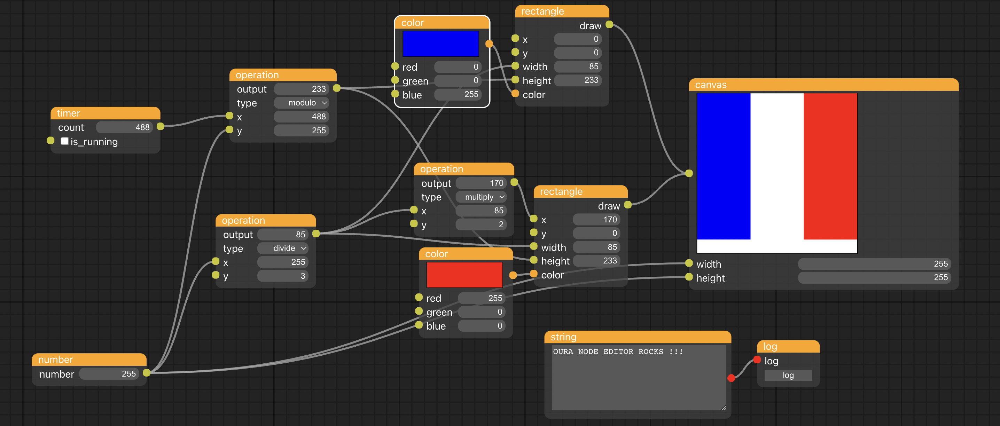

# Getting Started with Create React App

Tiny and experimental node based editor to create canvas.

This project was built mainly to test the [oura-node-editor](https://github.com/mathieuguyot/oura-node-editor)

You can test this project using this [link](https://mathieuguyot.github.io/oura-canvas-creator/)
(right click to add a node)

